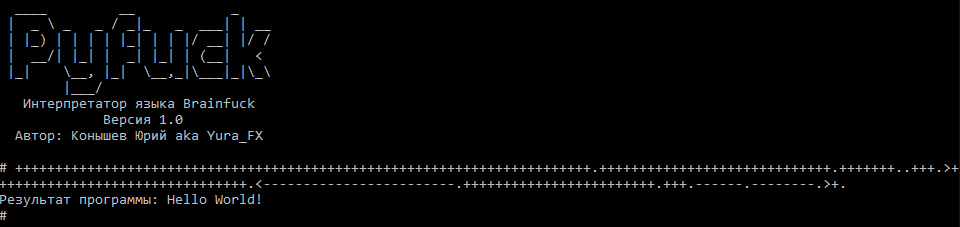
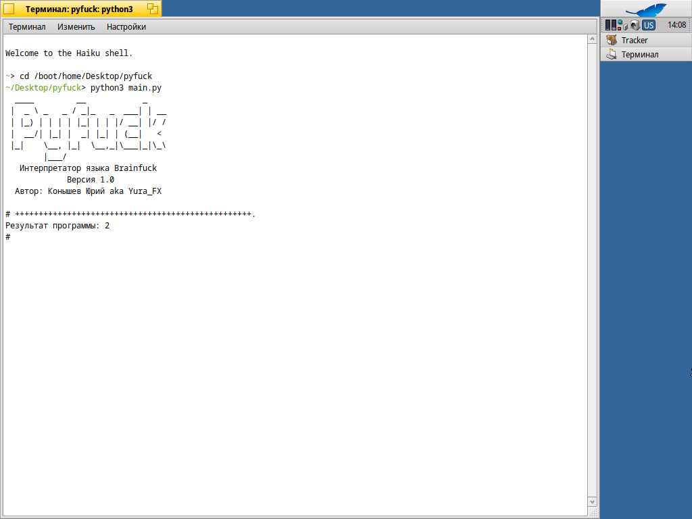
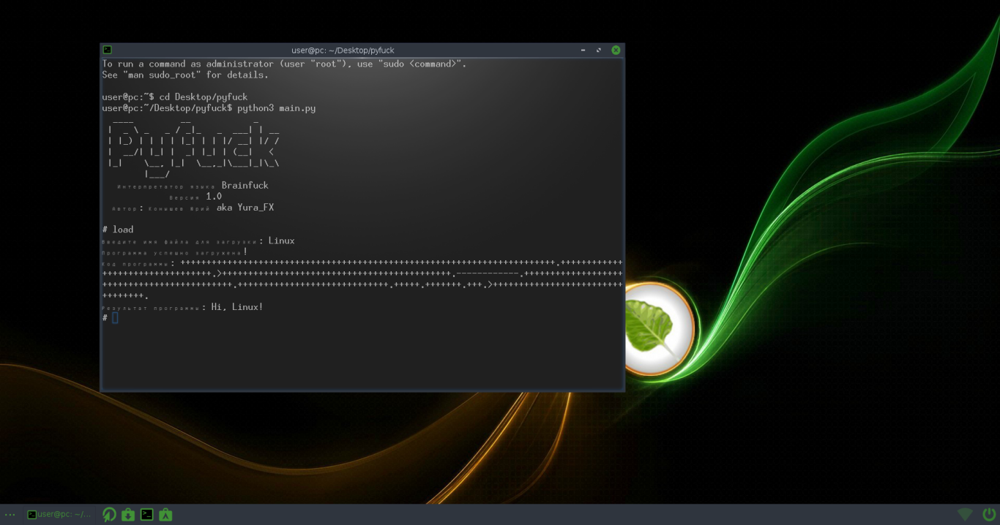

<p align="center"></p>
<h1 align="center">Интерпретатор языка Brainfuck</h1>

 [Финансовая поддержка](https://www.donationalerts.com/r/yura_fx) 

## Вступление

Сидел я тут как-то вечером и думал, что можно такое интересное написать на Python’е и тут я вспомнил, что когда-то давно, ещё на C#, 
пытался написать интерпретатор какого-нибудь простого языка, того же BASIC например, но особо ничего не получалось. В момент этих попыток 
я наткнулся на такой язык, как [Brainfuck](https://ru.wikipedia.org/wiki/Brainfuck) – по истине мозговыносящий эзотерический язык программирования (нестандартный язык, который 
создаётся с целью развлечения или исследования особенностей программирования. Он обычно имеет необычный синтаксис и принципы работы, 
что делает его сложным для понимания и использования в реальных проектах). Я начал смотреть видеоролики, просматривал статью на Википедии, 
чтобы понять, что это за язык и с чем его едят)) Итогом этого стало написание интерпретатора, который я назвал Pyfuck. Как-то так)

## О самом интерпретаторе

Интерпретатор имеет память под 30.000 однобайтовых ячеек с нулевыми начальными значениями (всё, как в оригинальном Brainfuck).

Имеется указатель текущей ячейки памяти и результирующая строка.

Интерпретатор также имеет функцию сохранения и загрузки написанной программы в формате `.bf`.

Важное примечание: Путём сохранения и открытия написанных программ является папка с exe-шником интерпретатора.

Он имеет все 8 команд Brainfuck:

|Команда |Описание                                           |
|--------|---------------------------------------------------|
|`>`     |Следующая ячейка                                   |
|`<`     |Предыдущая ячейка                                  |
|`+`     |Значение текущей ячейки увеличивает на 1           |
|`-`     |Значение текущей ячейки уменьшают на 1             |
|`.`     |Напечатать значение из текущей ячейки              |
|`,`     |Ввести извне значение и сохранить в текущей ячейке |
|`[`     |Начало цикла                                       |
|`]`     |Конец цикла                                        |

### Как составляется программа?

Тут всё довольно интересно) Для составления программ удобно использовать таблицу символов ASCII:


Мы должны обратить внимание на Decimal (это число, которое соответствует определённому символу. Это десятичное 
представление числа символа в таблице ASCII. Например, символ «A» имеет значение 65 в ASCII). В Brainfuck это 
будет выглядеть, как 65 команд «+».

Вот пример программы, печатающая «Hello World!»:
```++++++++++++++++++++++++++++++++++++++++++++++++++++++++++++++++++++++++.+++++++++++++++++++++++++++++.+++++++..+++.>++++++++++++++++++++++++++++++++.<------------------------.++++++++++++++++++++++++.+++.------.--------.>+.```



## Варианты установки

* [Скачать](https://github.com/YuraFX/pyfuck/releases/tag/1.0) Windows-версию в релизах.

* Офлайн установка на [Haiku R1/beta 4](https://www.haiku-os.org/) (проверено на [Oracle VM VirtualBox](https://www.virtualbox.org/) 5.2.44):
  
  - Переходим в Deskbar -> Приложения -> Терминал
    
  - Проверяем версию Python:
      ```python3 --version``` (в версии R1/beta 4 предустановлен Python 3.9.14)

  - Затем вставляем [диск](https://github.com/YuraFX/pyfuck/blob/main/ISO/pyfuck.iso) с pyfuck
    
  - Копируем содержимое диска на Рабочий стол
    
  - Возвращаемся к Терминалу и вводим команду: ```cd /boot/home/Desktop/pyfuck```
    
  - И наконец вводим команду для запуска файла main.py: ```python3 main.py```
 
    Результат:
    

* Офлайн установка на [Bodhi Linux](https://www.bodhilinux.com/) 5.1.0 (проверено на [Oracle VM VirtualBox](https://www.virtualbox.org/) 5.2.44):

  - Открываем Терминал
    
  - Проверяем версию Python: ```python3 --version``` (в версии 5.1.0 предустановлен Python 3.6.9)
    
  - Затем вставляем [диск](https://github.com/YuraFX/pyfuck/blob/main/ISO/pyfuck.iso) с pyfuck
    
  - Копируем содержимое диска в Places -> Desktop
    
  - Возвращаемся к Терминалу и вводим команду: ```cd Desktop/pyfuck```
    
  - И наконец вводим команду для запуска файла main.py: ```python3 main.py```

    Результат:
    

## О лицензии


Это [свободная программа](https://www.gnu.org/philosophy/free-sw.html): вы можете перераспространять ее и/или изменять ее на 
условиях [Стандартной общественной лицензии GNU](https://www.gnu.org/licenses/gpl-3.0.html) в том виде, 
в каком она была опубликована [Фондом свободного программного обеспечения](https://www.fsf.org/); либо версии 3 лицензии, либо (по вашему выбору) любой более поздней версии.

Эта программа распространяется в надежде, что она будет полезной, но БЕЗО ВСЯКИХ ГАРАНТИЙ; даже без неявной гарантии 
ТОВАРНОГО ВИДА или ПРИГОДНОСТИ ДЛЯ ОПРЕДЕЛЕННЫХ ЦЕЛЕЙ. Подробнее см. в Стандартной общественной лицензии GNU.

Вы должны были получить [копию](https://github.com/YuraFX/pyfuck/blob/main/LICENSE) Стандартной общественной лицензии GNU вместе с этой программой. Если это не так, см. <https://www.gnu.org/licenses/>.
